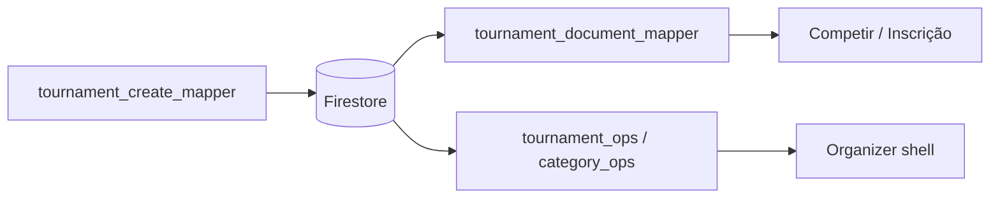

# Competition Data Contract — Business Rules Audit

Modo **read-only**. Formato: `.cursor/skills/tournament-league-audit/SKILL.md`.

Schema canônico: `docs/tournaments-firestore-schema.md`  
Gaps conhecidos: `.cursor/skills/tournament-league-audit/SKILL.md` (seção Gaps).

## Catálogo de invariantes

| ID | Invariante | Camadas que devem concordar | Risco se violado |
|----|------------|----------------------------|------------------|
| CC-01 | `listingStatus` | Wizard publish, Firestore, Competir, detail | Draft visível ou open ausente |
| CC-02 | `categoryId` = nome categoria | Inscriptions, matches, organizer filters | Rename quebra vínculos |
| CC-03 | `participantUids` | Write inscrição, Meus Torneios, queries org | Atleta não vê inscrição |
| CC-04 | `match.status` casing | CF write, match_ops read, live detection | XP/live não disparam |
| CC-05 | `enrolledCount` | Inscriptions paid, org KPI, category card | Lotado errado |
| CC-06 | `paidCount` / `pendingCount` | Inscription status, org shell KPIs | Badge Pagamentos errado |
| CC-07 | `bracketFormat` | Wizard mapper, category summary, generate CF | Rota chave errada |
| CC-08 | `uniformType` / `uniformRequired` | Wizard root, categories[], registration read | Kit não pedido na inscrição |
| CC-09 | `leagueId` + `isLeagueStage` | Factory, org badge, athlete detail | Etapa órfã no circuito |
| CC-10 | `liveMatchesNow` | Match ops write, tournament root | G1 “ao vivo” stale |
| CC-11 | Paths coleção | `tournaments/` vs legado | Rules/query miss |

## Diagrama de contrato



## Mapa de arquivos

| Contrato | Arquivos |
|----------|----------|
| Wizard → FS | `tournament_create_mapper.dart`, `league_create_mapper.dart` |
| FS → Atleta | `tournament_document_mapper.dart`, `league_document_mapper.dart` |
| FS → Org | `tournament_ops_logic.dart`, `category_ops_logic.dart`, providers |
| Status listing | `tournament_listing_status.dart`, `resolveListingStatus` |
| Schema doc | `docs/tournaments-firestore-schema.md` |

## Matriz de cenários

### Round-trip

1. Publicar torneio no wizard → ler doc Firestore → abrir detalhe atleta → abrir shell org — mesmos nomes, vagas, preços, formato.
2. Mesmo fluxo para liga + 1 etapa.
3. Após 1 inscrição paga — contagens org batem com query inscriptions.

### Bordas de contrato

- [ ] Torneio legado sem `participantUids`
- [ ] `listingStatus` ausente — inferência por data
- [ ] `match.status` minúsculo em doc antigo
- [ ] Categoria renomeada no wizard após inscrições
- [ ] `bracketFormat` string legada “Pool Play + SE”
- [ ] Torneio etapa liga sem `leagueStageOrder`

### Validação cruzada (checklist)

Para cada campo em `docs/tournaments-firestore-schema.md` usado em inscrição ou chave:

- [ ] Escrito pelo mapper/wizard
- [ ] Lido pelo atleta sem fallback silencioso errado
- [ ] Lido pelo organizador com mesma semântica

## Testes existentes

```bash
cd nexago_app && flutter test test/features/organizer/tournament_create_mapper_test.dart
cd nexago_app && flutter test test/features/tournaments/tournament_document_mapper_test.dart
cd nexago_app && flutter test test/features/tournaments/tournament_detail_logic_test.dart
```

## Handoff técnico

| Achado | Escalar para |
|--------|--------------|
| Bypass write / read ACL | `tournament-firestore-acl-auditor` |
| Discovery query | `tournament-listing-discovery-auditor` |
| Bracket generation mismatch | `tournament-bracket-category-auditor` |

## Escalar ao CBV

Não aplicável salvo contrato afetar pontuação/ranking público de forma injusta.
