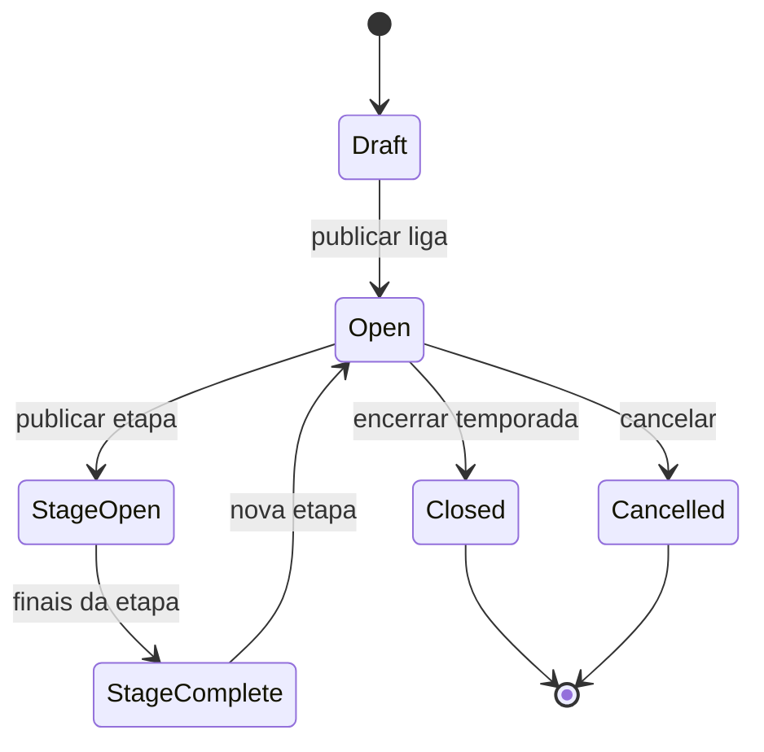

# League Circuit — Business Rules Audit

Modo **read-only**. Formato: `.cursor/skills/tournament-league-audit/SKILL.md`.

Skill técnica relacionada (não duplicar ACL): `.cursor/skills/league-circuit-audit/SKILL.md`.

## Catálogo de regras

| ID | Regra | Pré-condição | Pós-condição | Dono |
|----|-------|--------------|--------------|------|
| LC-01 | Liga publicada | Wizard C1–C6 completo | `leagues/{id}` com `listingStatus` adequado | Org |
| LC-02 | Etapa vinculada | Publish etapa D1–D3 | Torneio etapa `open`, não `draft` | Org |
| LC-03 | Vínculo liga↔torneio | Factory etapa | `leagueId`, `leagueStageId`, `isLeagueStage: true` | Sistema |
| LC-04 | Ordem de etapas | `stageOrder` único | Calendário coerente no detalhe da liga | Org/Atleta |
| LC-05 | Ranking por etapa | Final categoria na etapa | `leagueTeamRankings` atualiza 1º/2º | Sistema |
| LC-06 | Ranking acumulado | best-N configurado | `effectivePoints` = melhores N etapas | Atleta |
| LC-07 | Aba Atletas | Ranking duplas populado | Pontos espelham soma dos jogadores | Atleta |
| LC-08 | Encerrar temporada | Org encerra liga | `closed`; sem “Adicionar etapa” | Org |
| LC-09 | Cancelar liga | Org cancela | Some de Competir / status `cancelled` | Atleta |
| LC-10 | Categoria fechada na etapa | `registrationClosed` | Atleta não inscreve naquela categoria | Atleta |

## Máquina de estados (liga)



## Mapa de arquivos

| Camada | Path |
|--------|------|
| League wizard | `nexago_app/lib/features/organizer/presentation/league_create/` |
| Stage wizard | `league_stage_create/` |
| Domain | `league_create_logic.dart`, `league_stage_create_logic.dart` |
| Mappers | `league_create_mapper.dart`, `league_stage_tournament_factory.dart` |
| Ranking CF | `functions` → `applyLeagueRankingForMatch` |
| Atleta | `league_detail_page.dart`, `leagues_repository.dart`, `league_document_mapper.dart` |
| Rules | `firestore.rules` → `leagues/{id}` |

## Matriz de cenários

### Happy path (smoke B)

1. **B1** — Liga publicada + 1 etapa `open`
2. **B2** — Final da categoria na etapa → ranking liga 1º/2º
3. **B3** — Atleta vê mesmos pontos na aba Atletas
4. **B4** — Encerrar temporada → `closed`

### Bordas de negócio

- [ ] Etapa permanece `draft` após publish da liga
- [ ] Múltiplas etapas com mesma `stageOrder`
- [ ] best_4_of_6 com 5 etapas — `effectivePoints` correto (**L4** smoke)
- [ ] 3º lugar / quartas pontuam (**L2b**)
- [ ] Fase de grupos → pontos `groups` (**L2c**)
- [ ] Torneio órfão ao remover etapa
- [ ] Liga `closed` ainda aceita nova etapa na UI

### Extensões smoke

- **L5** — Dupla eliminação na etapa
- **L6/L7** — Encerrar / cancelar liga

## Testes existentes

```bash
cd nexago_app && flutter test test/features/organizer/league_create_logic_test.dart
cd nexago_app && flutter test test/features/organizer/league_create_mapper_test.dart
cd nexago_app && flutter test test/features/organizer/league_stage_tournament_factory_test.dart
cd nexago_app && flutter test test/features/tournaments/league_ranking_logic_test.dart
```

## Handoff técnico

| Achado | Escalar para |
|--------|--------------|
| Factory / batch Firestore | `league-circuit-auditor` |
| Rules `leagues` write | `tournament-firestore-acl-auditor` |
| Contagens / IDs drift | `competition-contract-rules-auditor` |

## Escalar ao CBV

- Critério de classificação geral do circuito
- Pontuação por colocação (grupos, quartas, 3º)
- Número mínimo de etapas para ranking válido
