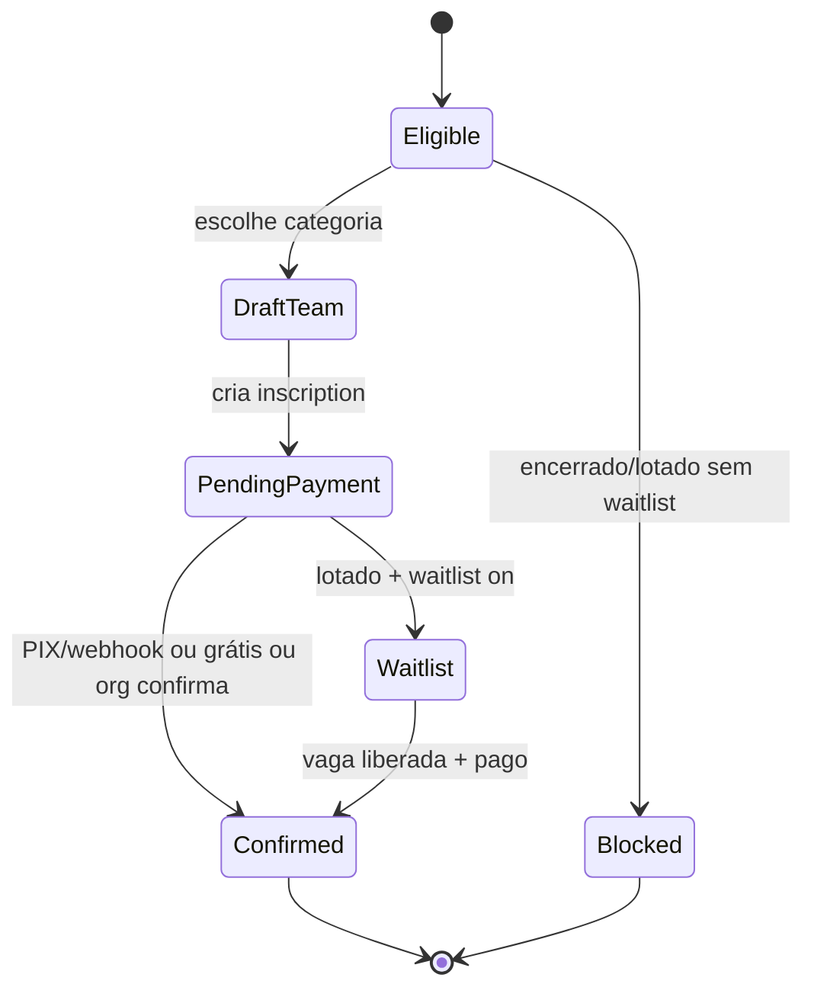

# Registration & Enrollment — Business Rules Audit

Modo **read-only**. Formato: `.cursor/skills/tournament-league-audit/SKILL.md`.

Skill técnica (PIX, rules, webhook): `.cursor/skills/tournament-registration-audit/SKILL.md`.

## Catálogo de regras

| ID | Regra | Pré-condição | Pós-condição | Dono |
|----|-------|--------------|--------------|------|
| RE-01 | Inscrição aberta | `listingStatus: open`, janela válida | Atleta inicia fluxo | Atleta |
| RE-02 | Vaga disponível | `enrolled < maxTeams` | Inscrição conta na vaga | Atleta |
| RE-03 | Lotado sem waitlist | Vagas esgotadas, waitlist off | Bloqueio claro | Atleta |
| RE-04 | Lotado com waitlist | Vagas esgotadas, waitlist on | `waitlist: true`, não conta vaga | Atleta |
| RE-05 | Inscrições encerradas | `registrationClosed` ou torneio `closed` | Atleta não inicia (**A5**) | Atleta |
| RE-06 | Pagamento PIX | Inscrição criada `isPaid: false` | Confirma só após webhook/CF (**A2**) | Sistema |
| RE-07 | Inscrição grátis | `entryFee` 0 | `confirmFreeTournamentRegistration` | Atleta |
| RE-08 | Convite parceiro | Inviter envia | Invitee aceita → dupla completa | Atleta |
| RE-09 | Status organizador | `isPaid` / `waitlist` | Confirmada / Pendente / Fila no shell | Org |
| RE-10 | Uniforme obrigatório | `categoryRequiresUniform` | Formulário exige dados do kit | Atleta |
| RE-11 | Meus torneios | Inscrição confirmada | Aparece na lista do atleta | Atleta |
| RE-12 | Dupla inválida | Mesmo UID em P1 e P2 | Bloqueio antes de pagar | Atleta |

## Máquina de estados (inscrição)



## Mapa de arquivos

| Camada | Path |
|--------|------|
| UI atleta | `tournament_registration_page.dart`, `tournament_registration_pix_page.dart` |
| Service | `tournament_registration_service.dart` |
| Invite | `tournament_partner_invite_service.dart` |
| Organizer status | `category_ops_logic.dart` → `registrationStatusFromInscription` |
| Organizer UI | `organizer_category_shell_page.dart`, `organizer_team_list_tile.dart` |
| Meus torneios | `my_tournament_registrations_repository.dart` |
| Uniforme | `tournament_document_mapper.dart` → `categoryRequiresUniform` |

## Matriz de cenários

### Happy path (smoke)

- **A2** — Inscrever dupla PIX até confirmação
- **A5** — Após encerrar inscrições, atleta não inicia nova

### Bordas de negócio

- [ ] Pagamento parcial (um atleta paga, outro não)
- [ ] Convite expirado / já aceito
- [ ] Re-inscrição mesma categoria
- [ ] Categoria `registrationClosed` com torneio ainda `open`
- [ ] Contagem organizer (`paidCount`) vs inscrições reais
- [ ] Inscrição legada sem `participantUids` — ainda aparece em Meus Torneios?
- [ ] Cancelamento PIX pendente

### Coerência org ↔ atleta

| Org vê | Atleta deve ver |
|--------|-----------------|
| Confirmada (Pago) | Inscrição ativa / Meus Torneios |
| Pendente | Aguardando pagamento |
| Lista de espera | Posição ou status fila |

## Testes existentes

```bash
cd nexago_app && flutter test test/features/tournaments/tournament_registration
cd nexago_app && flutter test test/features/organizer/category_ops_logic_test.dart
cd functions && npm test -- --testPathPattern=registration
```

## Handoff técnico

| Achado | Escalar para |
|--------|--------------|
| Client seta `isPaid` | `tournament-registration-auditor` + `tournament-firestore-acl-auditor` |
| Webhook / valor PIX | `tournament-registration-auditor` |
| `participantUids` drift | `competition-contract-rules-auditor` |

## Escalar ao CBV

- Inscrição em categoria de nível inadequado
- WO por não pagamento vs regulamento
- Dupla com composição irregular
