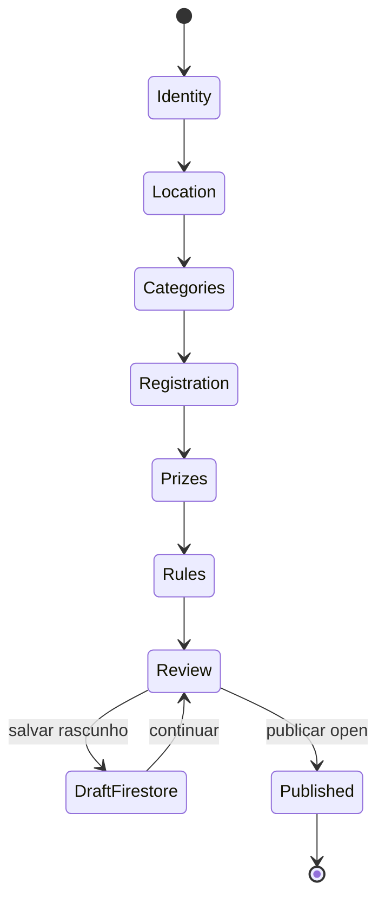

# Tournament Create — Business Rules Audit

Modo **read-only**. Formato de achado: `.cursor/skills/tournament-league-audit/SKILL.md`.

Diferença dos agents técnicos: valida **o que o organizador configura vs o que vale na inscrição/operação**, não ACL/webhook.

## Catálogo de regras

| ID | Regra | Pré-condição | Pós-condição esperada | Dono |
|----|-------|--------------|----------------------|------|
| TC-01 | Torneio precisa de ≥1 categoria para publicar | Wizard em review | `categories[]` não vazio no Firestore | Org |
| TC-02 | Vagas por categoria | `spots` definido | `maxTeams`/`spotsTotal` = spots no doc | Org |
| TC-03 | Preço por categoria vs default | `useDefaultPrice` true/false | `entryFeeCents` correto por categoria | Org/Atleta |
| TC-04 | Formato de chave por categoria | `bracketSystem` na categoria | `bracketFormat` persistido via mapper | Org |
| TC-05 | Janela de inscrição | `registrationOpensAt`/`ClosesAt` | Atleta só inscreve dentro da janela | Atleta |
| TC-06 | Waitlist habilitado | `waitlistEnabled` | Inscrição extra vai para fila, não conta vaga | Atleta/Org |
| TC-07 | Uniforme na inscrição | `uniformRequired` no draft | Propagado em `categories[].uniformType` + flags número/nome | Atleta |
| TC-08 | Publicação | Review → publish | `listingStatus: open` (não draft) | Org/Atleta |
| TC-09 | Leitura atleta | Torneio publicado | `tournament_document_mapper` expõe mesmas regras | Atleta |
| TC-10 | Edição pós-inscrição | Torneio com inscritos | Campos críticos bloqueados ou com aviso | Org |

## Máquina de estados (wizard)



## Mapa de arquivos

| Camada | Path |
|--------|------|
| Domain | `nexago_app/lib/features/organizer/domain/tournament_create/tournament_create_logic.dart` |
| Draft | `tournament_create_draft.dart`, `tournament_create_providers.dart` |
| Mapper | `nexago_app/lib/features/organizer/data/tournament_create_mapper.dart` |
| UI steps | `nexago_app/lib/features/organizer/presentation/tournament_create/steps/` |
| Publish | `tournament_published_page.dart`, `tournament_create_review_page.dart` |
| Leitura atleta | `nexago_app/lib/features/tournaments/data/tournament_document_mapper.dart` |
| Schema | `docs/tournaments-firestore-schema.md` |

## Matriz de cenários

### Happy path

1. Org cria torneio com 2 categorias, preços diferentes, publica `open`.
2. Atleta vê categorias com vagas, preço e formato corretos em Competir/detalhe.
3. `uniformRequired` + número/nome refletidos na inscrição (`categoryRequiresUniform`).

### Bordas de negócio

- [ ] Torneio sem categoria — review bloqueia ou publica vazio?
- [ ] Categoria com 0 vagas
- [ ] `useDefaultPrice` vs preço custom por categoria
- [ ] `bracketSystem` diferente entre categorias no mesmo torneio
- [ ] `waitlistEnabled: false` com categoria lotada — atleta vê o quê?
- [ ] Republicar/editar identidade após 1ª inscrição paga
- [ ] Rascunho local vs rascunho Firestore — qual prevalece?
- [ ] Uniforme desligado — toggles filhos resetam?

### Abuso de negócio (não técnico)

| Cenário | Esperado |
|---------|----------|
| Org publica com categoria “Open” mas nível Avançado nas regras | Atleta entende restrição? |
| Premiação R$ 0 vs omitida | UI coerente? |
| Regras CBV custom vs padrão | Refletidas no detalhe público? |

## Smoke

- **A1** (publicar `open` → Competir): `docs/tournament-league-smoke-dev.md`

## Testes existentes

```bash
cd nexago_app && flutter test test/features/organizer/tournament_create_logic_test.dart
cd nexago_app && flutter test test/features/organizer/tournament_create_mapper_test.dart
cd nexago_app && flutter test test/features/tournaments/tournament_document_mapper_test.dart
```

## Handoff técnico

| Achado tipo | Escalar para |
|-------------|--------------|
| `listingStatus` / discovery | `tournament-listing-discovery-auditor` |
| Mapper / schema drift | `competition-contract-rules-auditor` |
| Rules Firestore write | `tournament-firestore-acl-auditor` |

## Escalar ao CBV

- Categoria/nível incompatível com perfil do atleta (sandbagging)
- Formato de chave injusto para N equipes
- Regras de uniforme vs regulamento local
