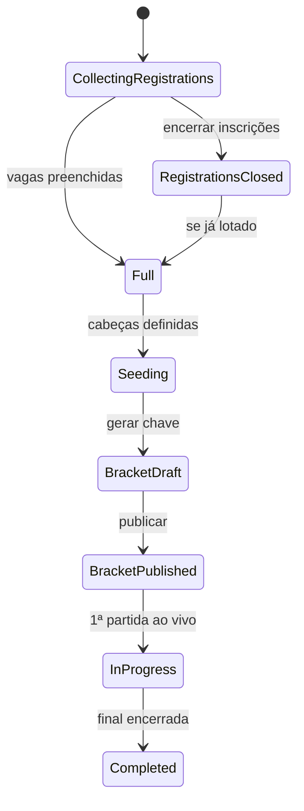

# Tournament Operations — Business Rules Audit

Modo **read-only**. Formato: `.cursor/skills/tournament-league-audit/SKILL.md`.

Skills técnicas: `tournament-bracket-category-audit`, `tournament-match-ops-audit`.

## Catálogo de regras

| ID | Regra | Pré-condição | Pós-condição | Dono |
|----|-------|--------------|--------------|------|
| TO-01 | Painel torneio | Torneio `open` | KPIs coerentes com Firestore | Org |
| TO-02 | Entrar na categoria | Categoria com inscrições | Shell mostra duplas, filtros, KPIs | Org |
| TO-03 | Pronto para chave | `enrolled >= maxTeams` | `readyToGenerateBracket` true, CTA visível | Org |
| TO-04 | Seeding | Antes de gerar chave | `categoryOps.seeds` persistido | Org |
| TO-05 | Gerar chave | Pré-condições CF | Matches `Scheduled`, `bracketStatus: published` | Org |
| TO-06 | Republicar chave | Chave já existe | Sem duplicata órfã / idempotência | Org |
| TO-07 | Encerrar inscrições | Org fecha torneio/categoria | Atleta bloqueado (**A5**) | Org/Atleta |
| TO-08 | Agenda partida | Chave publicada | Match com horário/quadra | Org |
| TO-09 | Chamar para quadra | Match agendado | `on_court`, atleta vê ao vivo (**A4**) | Org |
| TO-10 | Placar completo | Partida em andamento | `Completed`, avanço vencedor (**A3**) | Org |
| TO-11 | Link público | Partida ao vivo | J2 read-only atualiza (**smoke 6**) | Atleta |
| TO-12 | Compartilhar inscrição | Torneio aberto | Deep link abre fluxo inscrição | Org |

## Máquina de estados (categoria operacional)



## Mapa de arquivos

| Camada | Path |
|--------|------|
| Painel | `organizer_tournament_detail_page.dart`, `organizer_tournament_category_card.dart` |
| Shell categoria | `organizer_category_shell_page.dart`, `organizer_category_shell_header.dart` |
| Teams tab | `organizer_category_teams_tab.dart`, `organizer_team_list_tile.dart` |
| Seeding | `organizer_category_seeding_page.dart` |
| Bracket CF | `functions/src/organizer-category-ops.ts` |
| Bracket UI | `organizer_category_bracket_page.dart`, `double_elimination_bracket_canvas.dart` |
| Match ops | `nexago_app/lib/features/organizer/presentation/match_ops/` |
| Domain | `category_ops_logic.dart`, `tournament_ops_logic.dart` |
| Deep link | `app_deep_link_logic.dart`, share URI inscrição |

## Matriz de cenários

### Happy path (smoke A)

| Passo | Regra |
|-------|-------|
| A3 | Gerar chave + encerrar 1 partida, vencedor avança |
| A4 | Chamar para quadra → atleta vê ao vivo |
| A5 | Encerrar inscrições bloqueia atleta |

### Bordas de negócio

- [ ] Gerar chave com categoria não lotada — permitido ou bloqueado?
- [ ] N ímpar de equipes (bye)
- [ ] 0 ou 1 inscrito pago na categoria
- [ ] Filtros shell (Pendentes, Fila) vs contagem KPI
- [ ] `pendingCount` badge aba Pagamentos
- [ ] WO e efeito no bracket
- [ ] Torneio liga — badge e navegação para circuito

### Sequência proibida (validar mensagem UI)

1. Gerar chave antes de seeding (se aplicável)
2. Placar sem check-in (se exigido)
3. Nova inscrição após `closeTournamentRegistrations`

## Testes existentes

```bash
cd nexago_app && flutter test test/features/organizer/category_ops
cd nexago_app && flutter test test/features/organizer/tournament_ops_logic_test.dart
cd nexago_app && flutter test test/features/tournaments/app_deep_link_logic_test.dart
cd functions && npm test -- --testPathPattern=organizer-category-ops
```

## Handoff técnico

| Achado | Escalar para |
|--------|--------------|
| `generateCategoryBracket` / advance | `tournament-bracket-category-auditor` |
| Fila, placar, live | `tournament-match-ops-auditor` |
| Contagens KPI drift | `competition-contract-rules-auditor` |

## Escalar ao CBV

- Seeding por ranking vs sorteio
- Formato DE / repescagem / grand final
- WO e classificação em grupos
